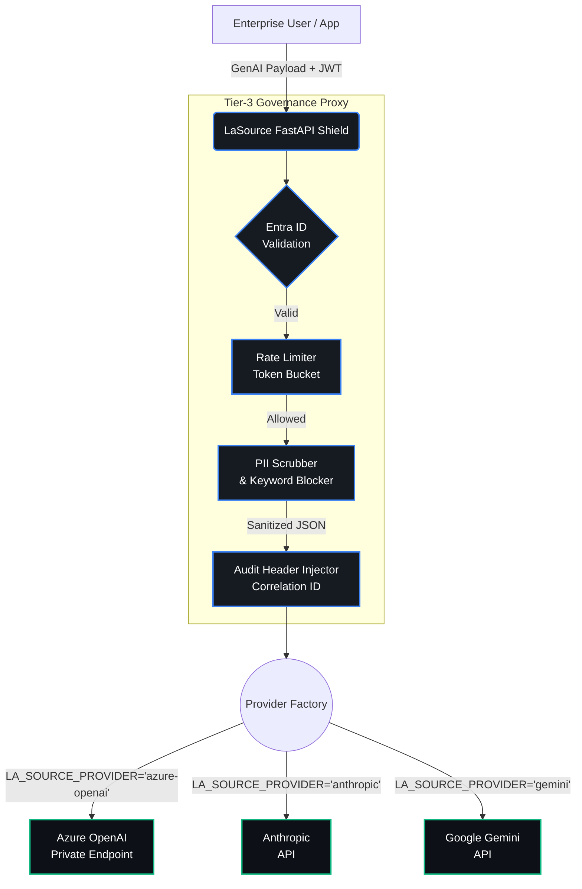

<div align="center">
  
  <br/><br/>
  <h1>LaSource: Universal AI Governance Framework</h1>
  <p><em>The definitive governance layer for the 2026 multi-model era.</em></p>
</div>

<br />

## 🛡️ The Problem: Enterprise 'Model Chaos'
As organizations adopt AI at scale, they face a growing crisis: **Model Chaos**. Engineering teams are simultaneously deploying Azure OpenAI, Anthropic on AWS, Google Gemini, and Cohere. Each provider has different security models, distinct telemetry paradigms, and fragmented data loss prevention (DLP) controls. This fragmentation makes centralized governance, unified auditing, and strict PII isolation nearly impossible.

## 🔑 The Value: A Single 'Shield'
**LaSource** provides a single, model-agnostic security gateway. Deployed within your secure VNET, the LaSource "Shield" intercepts all outbound GenAI requests. It normalizes authentication (e.g., Azure Entra ID mapping), scrubs sensitive data, enforces rate limits, and standardizes OpenTelemetry (OTel) signals—regardless of the underlying foundation model. 

You write your client logic once; LaSource dynamically manages the downstream provider safely and compliantly.

## 🏗️ The Architecture

<div align="center">
  
</div>

LaSource acts as an isolated middleware proxy. It strictly separates the inspection and validation logic from the actual model connections.



## 🔒 Compliance & Safety
Built for heavily regulated industries, LaSource ensures:
* **HIPAA & GDPR Readiness:** The inline **PII Scrubber** detects and redacts personal health information and personally identifiable information *before* it leaves your network. 
* **SOC2 Compliance:** Cryptographic correlation IDs, centralized audit logging, and immutable security violation tracking ensure you are always ready for an audit.
* **Zero-Trust Network Isolation:** Built to run on private endpoints (Azure Private Link, AWS PrivateLink) with strict egress firewall rules.

## 📜 Open Source & Licensing

LaSource is built from the ground up to be free, extensible, and universally accessible for the community. 

**Monetization & Licensing Status:**
* **100% Open Source (Monetizable):** There are no "enterprise-only" gated features or premium tiers. Everything from the core Provider Factory to the Tier-3 FastAPI Shield is open. This flexibility makes it an ideal platform to build and monetize your own enterprise products on top of.
* **License:** Licensed fully under the permissive **[MIT License](./LICENSE)**. 
* **Commercial Use:** You are free to confidently use, modify, distribute, and monetize any SaaS application or enterprise solution built on top of LaSource, within your own infrastructure, without any upstream licensing fees. Build an enterprise solution, and monetize it fully.

## 🚀 Quick Start

### Prerequisites

- **Python 3.10+**
- **Node.js 18+** (for frontend)
- **Git**
- **Azure CLI** (for Azure deployments)
- **Azure Subscription** (for Azure OpenAI provider)

### Installation

#### 1. Clone the Repository

```bash
git clone https://github.com/manishrattan/LaSource.git
cd LaSource
```

#### 2. Set Up Python Environment

```bash
# Create virtual environment
python -m venv venv

# Activate virtual environment
source venv/bin/activate  # On Windows: venv\Scripts\activate
```

#### 3. Install Python Dependencies

```bash
# Install runtime dependencies
pip install -r requirements.txt

# Install development dependencies (optional)
pip install -r requirements-dev.txt
```

#### 4. Install Frontend Dependencies

```bash
npm install
```

#### 5. Configure Environment Variables

```bash
# Copy example configuration
cp .env.example .env

# Edit .env with your settings
# Required variables:
# - LA_SOURCE_PROVIDER: azure-openai, anthropic, or gemini
# - LA_SOURCE_MODEL: Model name (e.g., gpt-4o)
# - AZURE_OPENAI_ENDPOINT: Your Azure OpenAI endpoint
# - LOG_LEVEL: DEBUG, INFO, WARNING, or ERROR
```

Example `.env` file:

```bash
# Provider Configuration
LA_SOURCE_PROVIDER=azure-openai
LA_SOURCE_MODEL=gpt-4o

# Azure Configuration
AZURE_OPENAI_ENDPOINT=https://<your-resource>.openai.azure.com/

# Application Configuration
LOG_LEVEL=INFO
CORS_ORIGINS=http://localhost:3000,http://localhost:8000

# Authentication
AZURE_TENANT_ID=<your-tenant-id>
```

### Running the Application

#### Start the FastAPI Server

```bash
cd src/lavoie/application

# Development mode (with auto-reload)
uvicorn main:app --reload --port 8000

# Production mode
uvicorn main:app --host 0.0.0.0 --port 8000 --workers 4
```

#### Start the React Frontend

```bash
npm run dev
```

Access the application at:
- **Frontend:** http://localhost:3000
- **API:** http://localhost:8000
- **API Docs:** http://localhost:8000/docs (Swagger UI)

### Health Check

Verify the application is running:

```bash
curl -H "Authorization: Bearer YOUR_AZURE_TOKEN" \
  http://localhost:8000/healthz
```

Expected response:

```json
{
  "status": "healthy",
  "provider": "AzureOpenAIProvider"
}
```

## 🧪 Testing

### Run Unit Tests

```bash
# Run all tests
pytest tests/ -v

# Run specific test file
pytest tests/test_shield.py -v

# Run with coverage
pytest tests/ --cov=lasource --cov-report=html
```

### Run Integration Tests

```bash
# Test with actual Azure OpenAI (requires credentials)
pytest tests/integration/ -v --azure-live
```

### Test Coverage

```bash
# Generate coverage report
pytest tests/ --cov=lasource --cov-report=html --cov-report=term

# View HTML report
open htmlcov/index.html  # On Windows: start htmlcov/index.html
```

## 📚 Usage Examples

### Using Azure OpenAI

1. **Set environment variables:**
   ```bash
   export LA_SOURCE_PROVIDER=azure-openai
   export LA_SOURCE_MODEL=gpt-4o
   export AZURE_OPENAI_ENDPOINT=https://<resource>.openai.azure.com/
   ```

2. **Start the server:**
   ```bash
   uvicorn main:app --reload
   ```

3. **Make a request:**
   ```bash
   curl -X POST http://localhost:8000/generate \
     -H "Authorization: Bearer YOUR_TOKEN" \
     -H "Content-Type: application/json" \
     -d '{"prompt": "What is AI?"}'
   ```

### Using with Docker

Build and run LaSource in Docker:

```bash
# Build image
docker build -f Dockerfile -t lasource:latest .

# Run container
docker run -p 8000:8000 \
  -e LA_SOURCE_PROVIDER=azure-openai \
  -e AZURE_OPENAI_ENDPOINT=https://<resource>.openai.azure.com/ \
  lasource:latest

# Access health endpoint
curl -H "Authorization: Bearer YOUR_TOKEN" \
  http://localhost:8000/healthz
```

## 🛠️ Development

### Code Structure

```
LaSource/
├── lasource/
│   ├── domain/              # Clean Architecture: Domain layer
│   │   ├── provider.py      # Abstract provider interface
│   │   ├── exceptions.py    # Custom exceptions
│   │   └── services/        # Domain services (PII scrubber, etc.)
│   ├── infrastructure/      # Clean Architecture: Infrastructure layer
│   │   ├── config.py        # Configuration management
│   │   └── factory.py       # Provider factory
│   ├── middleware/          # FastAPI middleware
│   │   └── shield.py        # Security middleware
│   └── providers/           # AI provider implementations
│       ├── azure_openai.py
│       └── anthropic_provider.py
├── src/
│   └── lavoie/
│       ├── application/     # FastAPI application
│       │   ├── main.py      # Application entry point
│       │   └── middleware/
│       ├── domain/          # Python domain logic
│       └── infrastructure/  # Python infrastructure
├── tests/                   # Test suite
├── src/ (React)             # Frontend React application
├── requirements.txt         # Python dependencies
├── package.json             # Node.js dependencies
└── vite.config.ts          # Vite configuration
```

### Adding a New Provider

1. Create a new file in `lasource/providers/`:
   ```python
   from lasource.domain.provider import AbstractProvider
   from lasource.domain.exceptions import LaSourceProviderError

   class MyProvider(AbstractProvider):
       def __init__(self):
           # Initialize provider
           pass
       
       def generate_response(self, prompt: str) -> str:
           # Implement response generation
           pass
       
       def health_check(self) -> bool:
           # Implement health check
           pass
   ```

2. Register in `lasource/providers/factory.py`:
   ```python
   from lasource.providers.my_provider import MyProvider
   
   SUPPORTED_PROVIDERS = {
       # ...existing providers...
       "my-provider": MyProvider,
   }
   ```

3. Add tests in `tests/test_providers/`

4. Update documentation

### Exception Handling

LaSource uses custom exceptions for consistent error handling:

```python
from lasource.domain.exceptions import (
    LaSourceException,
    LaSourceProviderError,
    LaSourceAuthenticationError,
    LaSourceSecurityError,
    LaSourceValidationError,
    LaSourceHealthCheckError,
)

# Catch specific exceptions
try:
    provider = ProviderFactory.get_provider()
except LaSourceConfigError as e:
    logger.error(f"Configuration error: {e.message}")
except LaSourceProviderError as e:
    logger.error(f"Provider error: {e.message}")
```

### Logging

LaSource uses Python's standard logging module:

```python
import logging

logger = logging.getLogger(__name__)

logger.debug("Debug message")
logger.info("Info message")
logger.warning("Warning message")
logger.error("Error message", exc_info=True)
```

Configure logging level via `LOG_LEVEL` environment variable.

## 🚢 Deployment

### Azure Deployment

Deploy LaSource to Azure using Bicep templates:

```bash
# Deploy infrastructure
az deployment sub create \
  --template-file infra/main.bicep \
  --parameters environment=prod \
  --location eastus

# Deploy application
az webapp up \
  --resource-group LaSource-RG \
  --name lasource-app
```

### Kubernetes Deployment

Deploy to Kubernetes cluster:

```bash
# Create namespace
kubectl create namespace lasource

# Deploy application
kubectl apply -f k8s/deployment.yaml -n lasource

# Check deployment status
kubectl get pods -n lasource
```

## 🤝 Contributing

We welcome contributions! Please see [CONTRIBUTING.md](./CONTRIBUTING.md) for:
- Development setup
- Code style guidelines
- Testing requirements
- Pull request process
- Provider implementation guide

## 📖 Documentation

- [SPEC.md](./SPEC.md) - Complete architectural specification
- [API Documentation](./API.md) - API reference
- [Architecture Guide](./docs/ARCHITECTURE.md) - Detailed architecture
- [Contributing Guide](./CONTRIBUTING.md) - How to contribute

## 🐛 Troubleshooting

### Authentication Errors

**Problem:** `Authentication failed` errors

**Solution:**
1. Verify Azure credentials: `az account show`
2. Check JWT token: Ensure it contains valid `aud` and `iss` claims
3. Review logs: `LOG_LEVEL=DEBUG`

### Provider Connection Errors

**Problem:** `Failed to connect to Azure OpenAI`

**Solution:**
1. Verify `AZURE_OPENAI_ENDPOINT` is set correctly
2. Check network connectivity: `curl -I {endpoint}`
3. Verify API version is supported
4. Check Azure resource quota

### Rate Limiting Issues

**Problem:** `Too Many Requests` (429)

**Solution:**
1. Reduce request frequency
2. Configure rate limiter in `shield.py`
3. Use distributed rate limiter (Redis) for production

### PII Detection False Positives

**Problem:** Legitimate data is being redacted

**Solution:**
1. Review regex patterns in `PIISanitizer`
2. Adjust patterns for your use case
3. Update `FORBIDDEN_KEYWORDS` list

## 📊 Performance & Scalability

- **In-Memory Rate Limiting:** Upgrade to Redis for distributed deployments
- **Audit Logging:** Stream to Azure Application Insights or OpenSearch
- **Provider Instances:** Use connection pooling for better throughput
- **Caching:** Implement token caching to reduce authentication overhead

## 📝 Changelog

See [CHANGELOG.md](./CHANGELOG.md) for version history and release notes.

## 📄 License

LaSource is licensed under the [MIT License](./LICENSE).

## 🙏 Acknowledgments

Built with:
- [FastAPI](https://fastapi.tiangolo.com/) - Modern Python web framework
- [Azure SDK](https://github.com/Azure/azure-sdk-for-python) - Azure integration
- [React](https://react.dev/) - Frontend UI
- [Vite](https://vitejs.dev/) - Frontend build tool

## 📧 Contact & Support

- **GitHub Issues:** [Report bugs and request features](https://github.com/manishrattan/LaSource/issues)
- **Discussions:** [Join community discussions](https://github.com/manishrattan/LaSource/discussions)
- **Email:** maintainers@lasource.dev
- **Documentation:** https://lasource.dev/docs

## ⭐ Show Your Support

If LaSource helps your organization, please consider:
- Giving us a GitHub star ⭐
- Contributing improvements
- Sharing your use case
- Spreading the word

---

**Made with ❤️ by the LaSource community**
