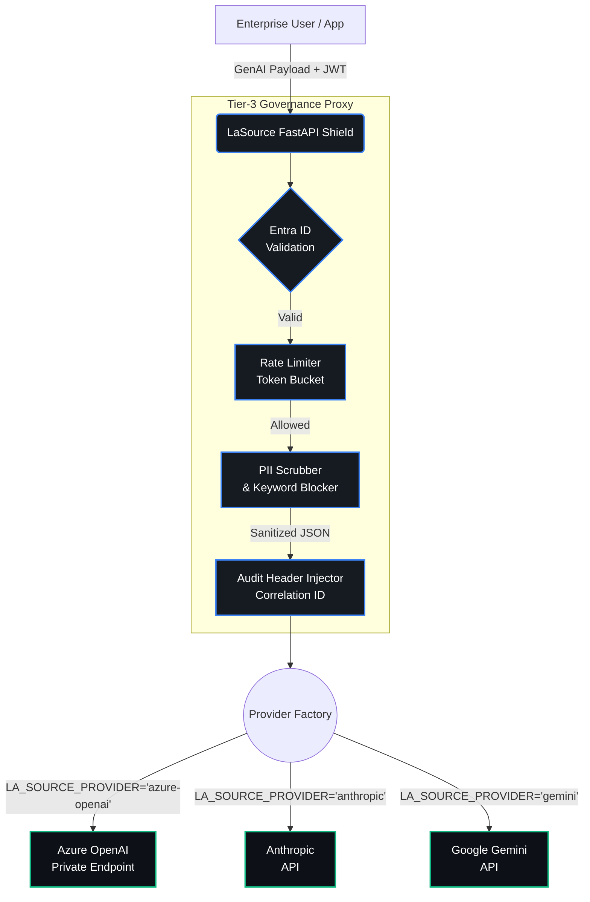

  
    
  <h1>LaSource: Universal AI Governance Framework</h1>
  
<em>The definitive governance layer for the 2026 multi-model era.</em>

 

## 🛡️ The Problem: Enterprise 'Model Chaos'
As organizations adopt AI at scale, they face a growing crisis: **Model Chaos**. Engineering teams are simultaneously deploying Azure OpenAI, Anthropic on AWS, Google Gemini, and Cohere. Each provider has different security models, distinct telemetry paradigms, and fragmented data loss prevention (DLP) controls. This fragmentation makes centralized governance, unified auditing, and strict PII isolation nearly impossible.

## 🔑 The Value: A Single 'Shield'
**LaSource** provides a single, model-agnostic security gateway. Deployed within your secure VNET, the LaSource "Shield" intercepts all outbound GenAI requests. It normalizes authentication (e.g., Azure Entra ID mapping), scrubs sensitive data, enforces rate limits, and standardizes OpenTelemetry (OTel) signals—regardless of the underlying foundation model. 

You write your client logic once; LaSource dynamically manages the downstream provider safely and compliantly.

## 🏗️ The Architecture

  

LaSource acts as an isolated middleware proxy. It strictly separates the inspection and validation logic from the actual model connections.

## 🔒 Compliance & Safety
Built for heavily regulated industries, LaSource ensures:
* **HIPAA & GDPR Readiness:** The inline **PII Scrubber** detects and redacts personal health information and personally identifiable information *before* it leaves your network. 
* **SOC2 Compliance:** Cryptographic correlation IDs, centralized audit logging, and immutable security violation tracking ensure you are always ready for an audit.
* **Zero-Trust Network Isolation:** Built to run on private endpoints (Azure Private Link, AWS PrivateLink) with strict egress firewall rules.

## 📜 Open Source & Licensing

LaSource is built from the ground up to be free, extensible, and universally accessible for the community. 

**Monetization & Licensing Status:**
* **100% Open Source (Monetizable):** There are no "enterprise-only" gated features or premium tiers. Everything from the core Provider Factory to the Tier-3 FastAPI Shield is open. This flexibility makes it an ideal platform to build and monetize your own enterprise products on top of.
* **License:** Licensed fully under the permissive **[Apache 2.0 License](https://www.apache.org/licenses/LICENSE-2.0)**. 
* **Commercial Use:** You are free to confidently use, modify, distribute, and monetize any SaaS application or enterprise solution built on top of LaSource, within your own infrastructure, without any upstream licensing fees. Build an enterprise solution, and monetize it fully.
